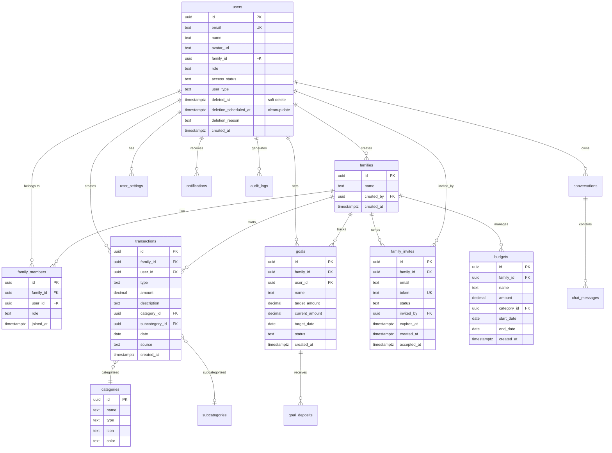

# Schema do Banco de Dados

## 📊 Diagrama ER (Completo)



**Soft Delete**: A tabela `users` inclui colunas `deleted_at`, `deletion_scheduled_at` e `deletion_reason` para suportar soft delete com período de recuperação de 30 dias.

## 📋 Tabelas Principais

### users

Usuários da aplicação.

| Coluna | Tipo | Descrição |
|--------|------|-----------|
| id | uuid | PK, referência auth.users |
| email | text | Email único |
| name | text | Nome completo |
| avatar_url | text | URL do avatar |
| family_id | uuid | FK → families |
| role | text | admin/member |
| access_status | text | active/waitlist/blocked |
| user_type | text | super_admin/admin/user |
| deleted_at | timestamptz | Data de soft delete (NULL = ativo) |
| deletion_scheduled_at | timestamptz | Data agendada para deleção permanente |
| deletion_reason | text | Motivo da deleção (opcional) |
| created_at | timestamptz | Data de criação |

**RLS:** Usuários veem apenas seus próprios dados

**Soft Delete:** Contas marcadas para deleção ficam 30 dias em recovery period. Função `cleanup_expired_user_deletions()` remove permanentemente após expiração.

### families

Grupos familiares.

| Coluna | Tipo | Descrição |
|--------|------|-----------|
| id | uuid | PK |
| name | text | Nome da família |
| created_by | uuid | FK → users |
| created_at | timestamptz | Data de criação |

**RLS:** Membros veem apenas sua família

### family_invites

Convites pendentes para entrar em famílias.

| Coluna | Tipo | Descrição |
|--------|------|-----------|
| id | uuid | PK |
| family_id | uuid | FK → families |
| email | text | Email do convidado |
| token | text | Token único para validação |
| status | text | pending/accepted/cancelled/expired |
| invited_by | uuid | FK → users (quem convidou) |
| expires_at | timestamptz | Data de expiração do linkconvite |
| created_at | timestamptz | Data de criação |
| accepted_at | timestamptz | Data de aceitação (NULL se pending) |

**RLS:** 6 políticas de segurança (view, create, update, delete, view by email, public view by token)

**Workflow**: Convite → Email com link → Aceitar → Criar family_members → Atualizar status

### transactions

Transações financeiras.

| Coluna | Tipo | Descrição |
|--------|------|-----------|
| id | uuid | PK |
| family_id | uuid | FK → families |
| type | text | income/expense |
| amount | decimal | Valor |
| description | text | Descrição |
| category_id | uuid | FK → categories |
| subcategory_id | uuid | FK → subcategories |
| date | date | Data da transação |
| source | text | Origem (chat/manual) |
| created_at | timestamptz | Data de criação |

**RLS:** Apenas membros da família

### categories

Categorias de transações.

| Coluna | Tipo | Descrição |
|--------|------|-----------|
| id | uuid | PK |
| name | text | Nome |
| type | text | income/expense |
| icon | text | Emoji/ícone |
| color | text | Cor hex |

**Dados:** Seed inicial com categorias padrão

### conversations

Conversas do chat.

| Coluna | Tipo | Descrição |
|--------|------|-----------|
| id | uuid | PK |
| user_id | uuid | FK → users |
| family_id | uuid | FK → families |
| title | text | Título |
| created_at | timestamptz | Data de criação |

### chat_messages

Mensagens do chat.

| Coluna | Tipo | Descrição |
|--------|------|-----------|
| id | uuid | PK |
| conversation_id | uuid | FK → conversations |
| role | text | user/assistant |
| content | text | Mensagem |
| created_at | timestamptz | Data de criação |

## 🔐 Row Level Security (RLS)

### Políticas Principais

**users:**
```sql
-- Ver próprios dados
CREATE POLICY "Users view own data"
  ON users FOR SELECT
  USING (auth.uid() = id);

-- Atualizar próprios dados
CREATE POLICY "Users update own data"
  ON users FOR UPDATE
  USING (auth.uid() = id);
```

**transactions:**
```sql
-- Ver transações da família
CREATE POLICY "Family members view transactions"
  ON transactions FOR SELECT
  USING (
    family_id IN (
      SELECT family_id FROM users 
      WHERE id = auth.uid()
    )
  );
```

**Admin:**
```sql
-- Super admins veem tudo
CREATE POLICY "Super admins view all"
  ON users FOR SELECT
  USING (
    EXISTS (
      SELECT 1 FROM users
      WHERE id = auth.uid()
      AND user_type = 'super_admin'
    )
  );
```

## 🔄 Migrações

Ver [migrations/README.md](../supabase/migrations/README.md) para ordem de execução.

**Principais migrações:**
1. `20240101000000` - Schema inicial (user_settings, family_invites)
2. `20240101000001` - Family members table
3. `20240101000006` - Controle de acesso (waitlist)
4. `20240101000007` - Conversas e chat
5. `20241128000002` - RLS policies para family_invites
6. `20241128000003` - Soft delete (deleted_at, funções de cleanup)

**Funções do Banco**:
- `permanently_delete_user(user_id UUID)` - Deleta permanentemente usuário e todos os dados
- `cleanup_expired_user_deletions()` - Auto-cleanup de contas expiradas (30 dias)

## 📊 Índices

```sql
-- Performance
CREATE INDEX idx_transactions_family_date 
  ON transactions(family_id, date DESC);

CREATE INDEX idx_transactions_category 
  ON transactions(category_id);

CREATE INDEX idx_users_family 
  ON users(family_id);
```

## 🔍 Queries Comuns

### Transações do mês

```sql
SELECT t.*, c.name as category_name
FROM transactions t
JOIN categories c ON t.category_id = c.id
WHERE t.family_id = $1
  AND t.date >= date_trunc('month', CURRENT_DATE)
ORDER BY t.date DESC;
```

### Estatísticas

```sql
SELECT 
  type,
  SUM(amount) as total
FROM transactions
WHERE family_id = $1
  AND date >= $2
  AND date <= $3
GROUP BY type;
```

## 📚 Referências

- [Supabase RLS](https://supabase.com/docs/guides/auth/row-level-security)
- [PostgreSQL Docs](https://www.postgresql.org/docs/)
